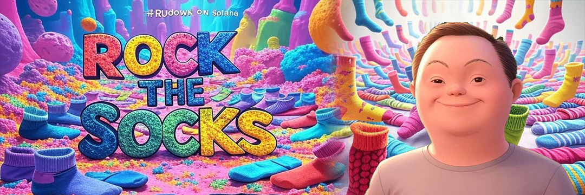

# RUdown Funding dApp 

The platform is a blockchain-based funding system dedicated to raising awareness and supporting projects related to Down Syndrome. It leverages the Solana network to provide a transparent, secure, and efficient method for funding initiatives. Users can donate, sponsor, or create campaigns that promote Down Syndrome advocacy, education, and support programs. By utilizing smart contracts, the platform ensures accountability and traceability of funds, allowing donors to track their contributions from start to completion. Additionally, it features decentralized governance to empower the community to vote on key projects, ensuring that resources are directed to the most impactful initiatives.

## Transparency is key

The system is published on GitHub, allowing full public access to the codebase for maximum transparency and community trust.

To prioritize safety, the platform is actively monitored by a dedicated team, ensuring all campaigns comply with ethical guidelines and protecting individuals from fraudulent activities. Smart contracts provide end-to-end traceability of funds, while the system's decentralized governance enables the community to vote on and verify impactful projects. This creates a safe and transparent environment for donors, sponsors, and campaign creators.

## Platform

Go to the [Funding Platform](https://rudown.com)
